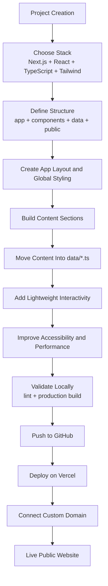

# Architecture Overview

This document explains how the project evolved from initial setup to a public deployment, and why the current architecture fits the product.

## 1. Project Goal

The project is a personal portfolio website for Andre Santos.

The main goals are:

- present professional experience and personal background
- keep the site visually polished and easy to navigate
- make content updates simple
- keep the stack lightweight and deployment-friendly
- support good accessibility and SEO by default

Because this is a portfolio and not a full product platform, the architecture intentionally stays simple.

## 2. High-Level Flow

## 3. Technology Choices

### Next.js

Next.js is the core framework.

Why it was a strong choice:

- server rendering and static rendering are built in
- metadata and layout handling are simple
- deployment on Vercel is straightforward
- it is a good fit for content-first websites
- it supports strong SEO with very little extra work

### React

React provides the component model used across the site.

Why it fits:

- sections are naturally component-based
- reusable UI patterns are easy to extract
- interactive behavior can be isolated to only the parts that need it

### TypeScript

TypeScript is used to keep data structures and components consistent.

Why it matters here:

- experience items, navigation items, and profile content are strongly shaped
- it reduces mistakes when content and UI evolve together
- it makes refactors safer

### Tailwind CSS

Tailwind is used for styling.

Why it fits this project:

- fast iteration for layout and spacing
- styling stays close to the component using it
- avoids creating many small CSS modules for a small project
- still allows global CSS where shared behavior is more appropriate

## 4. Project Structure

The project is organized into four main layers.

### `app/`

This contains the application entry points.

- `app/layout.tsx`
- `app/page.tsx`
- `app/globals.css`

Responsibilities:

- document structure
- metadata
- global styling
- composition of the homepage

### `components/`

This contains the UI and interactive building blocks.

Subgroups:

- `components/layout/`
- `components/sections/`
- `components/UI/`

Responsibilities:

- page shell and sidebar behavior
- section rendering
- reusable visual primitives

### `data/`

This contains site content and configuration.

Examples:

- `data/home.ts`
- `data/path.ts`
- `data/personal.ts`
- `data/profile.ts`
- `data/experience.ts`
- `data/navigation.ts`

Responsibilities:

- portfolio copy
- professional experience data
- profile information
- section navigation configuration

This is one of the most important architectural choices in the project.

Why:

- content changes do not require editing layout logic
- rendering components stay simpler
- the site behaves more like a content-driven system without the overhead of a CMS

### `public/`

This contains static assets:

- profile image
- company logos
- favicon

## 5. Rendering Strategy

The project is mostly server-rendered by default.

Only interactive components use `"use client"`.

Examples:

- `components/layout/SiteShell.tsx`
- `components/layout/Sidebar.tsx`

This is a good pattern because it keeps most of the site out of the client bundle.

That improves:

- initial load behavior
- bundle size
- maintainability

For a portfolio site, that is a much better tradeoff than making everything client-side.

## 6. Component Architecture

The page is built from section-level components:

- Home
- My Path
- Who Am I

These are composed in `app/page.tsx`.

Shared patterns were extracted into reusable components such as:

- `components/sections/SectionHeader.tsx`
- `components/UI/TextHighlights.tsx`
- `components/UI/FeatureGrid.tsx`
- `components/UI/SocialLinks.tsx`

There is also a tiny shared utility:

- `lib/cn.ts`

Why these extractions are good architecture:

- repeated layout structures are centralized
- consistency improves across sections
- styling changes become easier
- duplication is reduced

## 7. Content-Driven Design

The UI is deliberately driven by structured data rather than hardcoded content inside components.

Examples:

- navigation comes from `data/navigation.ts`
- work history comes from `data/experience.ts`
- profile intro and social links come from `data/profile.ts`

Why this is important:

- updating the portfolio is faster
- the structure is scalable if more sections are added later
- data and presentation stay loosely coupled

This is a lightweight version of a content architecture without adding a headless CMS.

## 8. Interactivity Strategy

Interactivity is intentionally limited and focused.

### Sidebar tracking

The sidebar uses `IntersectionObserver` to highlight the active section while scrolling.

Why this pattern was chosen:

- better performance than attaching heavy scroll calculations for every movement
- browser-native observation is efficient
- it matches the site’s single-page navigation model

The implementation also includes boundary logic for top and bottom of the page so the active state still behaves correctly on large screens.

### Spotlight effect

The spotlight visual effect is controlled in `SiteShell`.

It was updated to use `requestAnimationFrame`.

Why:

- pointer events can fire very frequently
- direct DOM writes on every event create avoidable work
- `requestAnimationFrame` aligns updates with the browser rendering cycle

### Experience cards

The experience cards use native `
` and `
`.

Why this was the right choice:

- better accessibility than a custom disclosure implementation
- less JavaScript
- fewer React state updates
- simpler component logic

This is a strong example of using the platform instead of recreating native behavior in React.

## 9. Accessibility and Quality Decisions

Several improvements were introduced as part of the refinement process.

Examples:

- skip link to main content
- focus styles for keyboard users
- stronger navigation contrast
- semantic disclosure behavior
- reduced exposure of collapsed content to assistive technology

Why this matters architecturally:

- accessibility should not be treated as a later visual patch
- semantic HTML reduces complexity
- accessible structure usually improves maintainability too

## 10. Performance Decisions

The project is small, but a few deliberate decisions help keep it efficient.

### Mostly server-rendered

Only interactive boundaries use client components.

### Native platform features

- `
/
` instead of React state for disclosure
- `IntersectionObserver` instead of manual scroll-heavy logic

### `next/image`

Used for profile and company images.

Why:

- responsive image handling
- image optimization support
- better control over loading behavior

### Shared utilities and reduced duplication

Less repeated logic means:

- fewer chances for divergence
- easier optimization
- easier future refactoring

## 11. Why This Architecture Fits The Product

This portfolio does not need:

- a database
- authentication
- a CMS
- a global state library
- an API backend
- microservices

Adding those would make the system more complex without adding real value.

The chosen architecture is intentionally:

- simple
- content-oriented
- easy to deploy
- easy to maintain
- easy to extend

That is the correct architectural direction for this kind of website.

## 12. From Local Project To Deployment

### Local development

The typical flow is:

1. edit content or components locally
2. run lint checks
3. run a production build locally
4. commit and push to GitHub

### Version control

GitHub is used as the central source of truth.

Why:

- version history
- safe rollback
- deployment integration
- easier future collaboration

### Deployment platform

The recommended platform is Vercel.

Why:

- it is optimized for Next.js
- minimal configuration is needed
- preview and production deployments are straightforward
- SSL is handled automatically
- domain management is simple

## 13. Deployment Flow

## 14. Custom Domain Flow

Once the project is deployed on Vercel:

1. add the custom domain in the Vercel dashboard
2. Vercel shows the DNS records required
3. update those records at your domain registrar
4. wait for DNS propagation
5. Vercel provisions HTTPS automatically

After that, the project is live on the final public domain.

## 15. Operational Notes

### Node version

The project uses a modern Next.js version, so production builds require Node `>=20.9.0`.

This matters for:

- local builds
- CI
- deployment environments

### Validation

Before deployment, the main checks should be:

- `npm run lint`
- `npm run build`

This helps catch code issues and production incompatibilities early.

## 16. Future Evolution

If the project grows later, the current architecture can evolve in safe steps.

Possible future directions:

- add a contact form via a server action or external provider
- add analytics
- add a blog section
- move content to MDX or a CMS if updates become frequent
- add automated accessibility and performance audits

The current structure supports those changes without needing a rewrite.

## 17. Summary

The final architecture is a lightweight, content-driven, mostly server-rendered Next.js portfolio.

It uses:

- clear separation between content and UI
- limited client-side interactivity
- semantic HTML where possible
- reusable section and UI primitives
- a deployment model that matches the simplicity of the product

This is a good example of choosing architecture based on product needs instead of adding complexity for its own sake.
